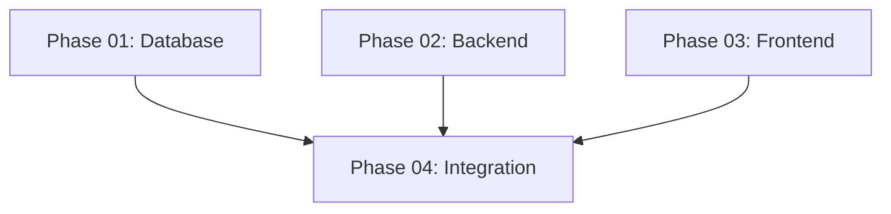

# System Admin Role Implementation Plan

## Overview

Add `system_admin` role for super-admin access above tenant level. System admins can manage all companies, users, and system-wide operations without tenant restrictions.

## Dependency Graph

**Parallel execution:** Phases 01, 02, 03 can run simultaneously
**Sequential execution:** Phase 04 requires 01, 02, 03 complete

## File Ownership Matrix

| Phase | Files Owned | Dependencies |
|-------|-------------|--------------|
| 01 - Database | V16__Add_system_admin_role.sql | None |
| 02 - Backend | UserInfo.java, SystemAdminController.java, SystemAdminService.java, CompanyManagementService.java | None |
| 03 - Frontend | admin/*.html, admin.css, admin.js | None |
| 04 - Integration | SecurityConfig.java | 01, 02, 03 |

## Implementation Phases

### Phase 01: Database Migration (1h)
- Add `system_admin` to role enum
- Create system admin seed user
- Add company status fields

### Phase 02: Backend Domain & API (2h)
- Update UserRole enum in UserInfo.java
- Create SystemAdminController + service layer
- Implement cross-tenant queries
- Add company management APIs

### Phase 03: Frontend Admin Panel (2h)
- Create admin panel templates
- Build company list + user list views
- Add system dashboard
- Admin-specific CSS/JS

### Phase 04: Security Integration (1h)
- Update SecurityConfig for /admin/** routes
- Add @PreAuthorize guards
- Test role-based access control
- Integration testing

## Success Criteria

- [ ] System admin can login with role `system_admin`
- [ ] System admin can access `/admin/**` routes
- [ ] Regular users blocked from admin panel
- [ ] Company list displays all tenants
- [ ] User list shows cross-tenant data
- [ ] Security tests pass

## Validation Summary

**Validated:** 2026-02-06
**Questions asked:** 4

### Confirmed Decisions
- **Tenant model:** Special system company (id=0) for system admin user
- **Login flow:** Same /login page, redirect to /admin/dashboard based on role
- **Admin scope:** Full CRUD — create, edit, delete companies and users cross-tenant
- **Suspension:** Block ALL users of suspended company from logging in (403 on login)

### Action Items
- [ ] Phase 02: Expand API scope from view+suspend to full CRUD (add create/edit/delete endpoints)
- [ ] Phase 02: Add company create, user edit/delete endpoints to SystemAdminController
- [ ] Phase 03: Add create/edit/delete UI components (forms, modals) to admin panel
- [ ] Phase 04: Add suspension check in JwtAuthenticationFilter (block login if company suspended)
